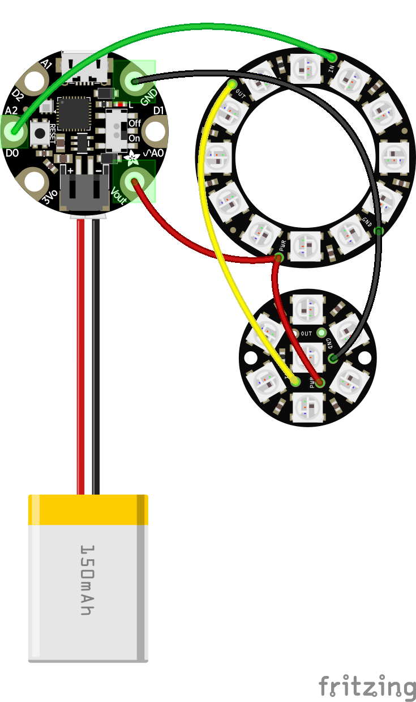

# Wearable LED Earrings, powered by Python!

Brilliant LED Earrings. Powered by CircuitPython.

## Build

Built with:
 - [Gemma m0](https://www.adafruit.com/product/3501) wearable electronics platform
 - Single WS2812 LED
 - 8 pixel WS2812 LED Ring
 - 12 pixel WS2812 LED Ring
 - Adafruit [150 mAh tiny lipo](https://www.adafruit.com/product/1317)
 - Earring trimmings

 See `main.py` for the code. Follow the instructions for [loading code onto the gemma](https://learn.adafruit.com/adafruit-gemma-m0/circuitpython).

## Fritizng Diagram

## Inspired By

Inspired by the original [Gemma hoop earrings tutorial](https://learn.adafruit.com/gemma-hoop-earrings/overview).